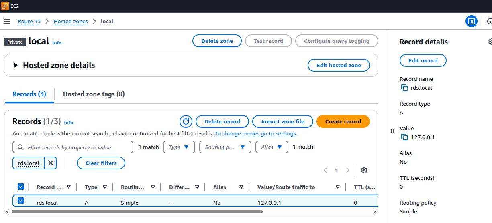

https://www.learnxops.com/p/aws-cloud-automation-with-python-boto3

```shell
python3 -m venv venv
. venv/bin/activate
pip install boto3
pip install boto3[crt]
pip freeze > requirements.txt
```
🔹 Challenge 1: Write a Python script that provisions an EC2 instance, a new security group, and a key pair. The same script should connect to ec2 after creation to check that everything is working fine. (The key pair should be generated via the Python script and used for the EC2 SSH connection.)
code provision_ec2.py
```python
import boto3
import os
import time
ec2 = boto3.client("ec2")
ec2_resource = boto3.resource("ec2")
INSTANCE_TYPE = "t2.micro"
AMI_ID = "ami-00bb6a80f01f03502"
SGNAME = "day7_sg_SSH"
EC2_KEYPAIR_NAME = "SSH_DAY7"
SSH_USERNAME = "ubuntu"
def createSecurtityGroup():

    #https://boto3.amazonaws.com/v1/documentation/api/latest/reference/services/ec2/client/create_security_group.html
    try:
        response = ec2.create_security_group(Description="SSH Connect example",GroupName=SGNAME)
        SecurityGroupID = response["GroupId"]
        response = ec2.authorize_security_group_ingress(
            GroupId=SecurityGroupID,
            IpPermissions=[
                {
                    'IpProtocol': 'tcp',
                    'FromPort': 22,
                    'ToPort': 22,                    
                    'IpRanges': [{"CidrIp": "0.0.0.0/0"}]
                },
            ],
        )
    except Exception as e:
        #https://boto3.amazonaws.com/v1/documentation/api/latest/reference/services/ec2/client/describe_security_groups.html
        response = ec2.describe_security_groups(GroupNames=[SGNAME])
        SecurityGroupID = response["SecurityGroups"][0]["GroupId"]
    return SecurityGroupID
def create_key_pair():
    try:
        key_pair = ec2.create_key_pair(KeyName=EC2_KEYPAIR_NAME)
        file = open(f"{EC2_KEYPAIR_NAME}.pem","w")
        file.write(key_pair["KeyMaterial"])
        os.chmod(f"{EC2_KEYPAIR_NAME}.pem","400")
    except Exception as e:
        pass
    return f"{EC2_KEYPAIR_NAME}.pem"

def check_ec2_via_ssh(instance_ip, key_file):
    """Connects to EC2 via SSH and checks its status."""
    print("🔍 Connecting to EC2 instance via SSH...")

    try:        
        output = os.system(f"ssh -i {key_file} ubuntu@{instance_ip} -o StrictHostKeyChecking=no 'uptime'")
        print(output)
    except Exception as e:
        print(f"❌ SSH Connection Failed: {e}")

def launch_ec2_instance(SecurityGroupID,SSHKEY):
    #https://boto3.amazonaws.com/v1/documentation/api/latest/reference/services/ec2/client/run_instances.html
    instance = ec2_resource.create_instances(
        ImageId=AMI_ID,
        InstanceType=INSTANCE_TYPE,
        MinCount=1,
        MaxCount=1,
        KeyName=SSHKEY,
        SecurityGroupIds=[SecurityGroupID],
        TagSpecifications=[{
            "ResourceType": "instance",
            "Tags": [{"Key": "Name", "Value": "MyEC2Instance"}]
        }]
    )[0]
    print(f"✅ EC2 instance launched with ID: {instance.id}")
    instance.wait_until_running()
    instance.reload()
    time.sleep(60)
    return instance.public_ip_address
    pass
SecurityGroupID = createSecurtityGroup()
SSHKEY = create_key_pair()
IP = launch_ec2_instance(SecurityGroupID,EC2_KEYPAIR_NAME)
check_ec2_via_ssh(IP,SSHKEY)
```

🔹 Challenge 2: Automate S3 lifecycle policies using boto3 (e.g., move files to Glacier after 30 days).
code apply_lifecycle_to_s3.py
```python
import boto3
from datetime import datetime
s3 = boto3.client("s3","us-east-1")
def createBucket(name):
    isBucketCreated = False
    try:
        out = s3.create_bucket(Bucket=name)
        isBucketCreated = True
    except Exception as E:
        print(E)
    return isBucketCreated
def creareLifeCycle(bucketName):
    print(f"Creating LifecycleConfiguration for {bucketName}")
    response = s3.put_bucket_lifecycle(
            Bucket=bucketName,
            LifecycleConfiguration={
                'Rules': [
                    {
                        
                        'ID': 'MoveToGlacier',
                        'Prefix': '/',
                        'Status': 'Enabled',
                        'Transition': {
                            'Days': 30,
                            'StorageClass': 'GLACIER'
                        },
                        'NoncurrentVersionTransition': {
                            'NoncurrentDays': 30,
                            'StorageClass': 'GLACIER'
                        }
                    },
                ]
            }
        )
    print(response)

now = datetime.now().strftime("%Y-%m-%d-%H-%M-%S")
bucketName = "ramratan-"+now
print(bucketName)
Check = createBucket(bucketName)
print(Check)
if Check ==True:
    creareLifeCycle(bucketName)

```

🔹 Challenge 3: Create a script that starts or stops all EC2 instances in a specific AWS region.

code ec2_start_stop.py
```python
import boto3
region = input("Please input region to run : ")
#region = "ap-south-1"
ec2 = boto3.client("ec2",region)
instances = ec2.describe_instances(Filters=[{"Name":"instance-state-name","Values":['pending','running','stopped']}])

for Reservations in instances["Reservations"]:
    for instance in Reservations["Instances"]:
        print(f"Current State {instance['State']}")
        if instance["State"]["Name"] == "stopped":
            st = ec2.start_instances(InstanceIds=[instance["InstanceId"]])["StartingInstances"][0]["CurrentState"]
        else:
            st = ec2.stop_instances(InstanceIds=[instance["InstanceId"]])["StoppingInstances"][0]["CurrentState"]
        print(st)
```
🔹 Challenge 4: Write a Python program that checks for unused IAM users and disables them.

code check_iam_users.py
```python
import boto3
from datetime import datetime, timezone
import json

def get_iam_client():
    return boto3.client('iam')

def check_unused_users(days_threshold=90):
    iam = get_iam_client()
    
    try:
        # Get credential report
        iam.generate_credential_report()
        response = iam.get_credential_report()
        credentials = response['Content'].decode('utf-8').split('\n')
        
        # Skip the header row
        headers = credentials[0].split(',')
        print(headers)
        users = credentials[1:]
        
        current_time = datetime.now(timezone.utc)
        
        for user in users:
            user_data = dict(zip(headers, user.split(',')))
            username = user_data['user']
            password_enabled = user_data['password_enabled']
            # Skip root account
            if username == '<root_account>':
                continue
                
            password_last_used = user_data.get('password_last_used', 'N/A')
            access_key_1_last_used = user_data.get('access_key_1_last_used_date', 'N/A')
            access_key_2_last_used = user_data.get('access_key_2_last_used_date', 'N/A')
            
            is_unused = True
            
            # Check password usage
            if password_last_used != 'N/A' and password_last_used != 'no_information':
                last_used = datetime.fromisoformat(password_last_used.replace('Z', '+00:00'))
                days_since_use = (current_time - last_used).days
                if days_since_use < days_threshold:
                    is_unused = False
            
            # Check access key 1 usage
            if access_key_1_last_used != 'N/A' and access_key_1_last_used != 'no_information':
                last_used = datetime.fromisoformat(access_key_1_last_used.replace('Z', '+00:00'))
                days_since_use = (current_time - last_used).days
                if days_since_use < days_threshold:
                    is_unused = False
            
            # Check access key 2 usage
            if access_key_2_last_used != 'N/A' and access_key_2_last_used != 'no_information':
                last_used = datetime.fromisoformat(access_key_2_last_used.replace('Z', '+00:00'))
                days_since_use = (current_time - last_used).days
                if days_since_use < days_threshold:
                    is_unused = False
            
            if is_unused:
                print(f"User {username} has been inactive for more than {days_threshold} days")
                # Disable the user by attaching deny policy
                if password_enabled == True:
                    iam.update_login_profile(UserName=username, PasswordResetRequired=True)
                # Deactivate access keys
                try:
                    access_keys = iam.list_access_keys(UserName=username)['AccessKeyMetadata']
                    for key in access_keys:
                        iam.update_access_key(
                            UserName=username,
                            AccessKeyId=key['AccessKeyId'],
                            Status='Inactive'
                        )
                        print(f"Deactivated access key {key['AccessKeyId']} for user {username}")
                except Exception as e:
                    print(f"Error deactivating access keys for {username}: {str(e)}")
    except Exception as e:
        print(f"Error {str(e)}")

def main():
    # Set the threshold for unused days (default 90 days)
    UNUSED_DAYS_THRESHOLD = 90
    
    print(f"Checking for users inactive for more than {UNUSED_DAYS_THRESHOLD} days...")
    check_unused_users(UNUSED_DAYS_THRESHOLD)
    print("Completed checking for unused users")

if __name__ == "__main__":
    main()

```
🔹 Challenge 5: Implement a log monitoring system that scans EC2 instances' /var/log for error messages and sends alerts via email (AWS SES) and Slack.

code ec2_log_monitoring.py
```python
import boto3
import subprocess
import requests
from dotenv import load_dotenv
import os
load_dotenv(dotenv_path="../.env")
ec2 = boto3.client("ec2")
TAG = "log_monitoring"
key_file = "SSH_DAY7.pem"
ses = boto3.client("ses","us-east-1")

SLACK_WEBHOOK_URL = os.getenv("SLACK_WEBHOOK_URL")
def checkLogs(server):
    try:
        cmd = "grep -i 'error' /var/log/*.log | tail -n 10"
        ssh_cmd = f"ssh -i {key_file} ubuntu@{server['ip']} -o StrictHostKeyChecking=no '{cmd}'"
        errors = subprocess.check_output(ssh_cmd, shell=True, text=True)
        if errors!="":
           return {"instance_id":server['instance_id'],"logs":errors}
    except Exception as e:
        print(e)
def sendEmailNotification(errors):
    try:
        response = ses.send_email(
            Source="ramratan.gupta@gmail.com",
            Destination={"ToAddresses": ["ramratan.gupta@gmail.com"]},
            Message={
                "Subject": {"Data": "🚨 EC2 Log Monitoring Alert"},
                "Body": {"Text": {"Data": errors}}
            }
        )
        print("✅ Email alert sent!")
    except Exception as e:
        print(f"❌ Failed to send email: {e}")
def sendSlackNotification(errors):
    try:
        payload = {"text":errors}
        x = requests.post(SLACK_WEBHOOK_URL, json=payload)
        print(x)
    except Exception as e:
        print(f"❌ Failed to send email: {e}")
def monitorEC2():
    ips = getEC2Ips()
    error_logs = ""
    if len(ips)>0:
        for server in ips:
            errors = checkLogs(server)
            if errors!=None:
                error_logs=error_logs+f"\n\n\n🔴 {errors['instance_id']}\n\n{errors['logs']}"
        if len(error_logs)>0:
            #sendEmailNotification(error_logs)
            sendSlackNotification(error_logs)
    else:
        print("No Server found")
    
def getEC2Ips():
    ips = []
    ec2s = ec2.describe_instances(Filters=[{"Name": f"tag:{TAG}", "Values": ["*"]}, {"Name": "instance-state-name", "Values": ["running"]}])
    for Reservations in ec2s["Reservations"] :
        for instance in Reservations['Instances']:
            ips.append({"ip":instance["PublicIpAddress"],"instance_id":instance["InstanceId"]})
    return ips
if __name__ == "__main__":
    monitorEC2()
```
🔹 Challenge 6: Automate DNS record updates in AWS Route 53 using Python.
code update_route53.py
If you do not have domain you can create Private hosted zone
```python
import boto3
route53 = boto3.client("route53")
from dotenv import load_dotenv
import os
load_dotenv(dotenv_path="../.env")
HOSTED_ZONE_ID = os.getenv("HOSTED_ZONE_ID")
IP = "127.0.0.1"
domain="rds.local"
RECORD_TYPE = "A"
TTL = 0
change_batch = {
        "Changes": [
            {
                "Action": "UPSERT",
                "ResourceRecordSet": {
                    "Name": domain,
                    "Type": RECORD_TYPE,
                    "TTL": TTL,
                    "ResourceRecords": [{"Value": IP}]
                }
            }
        ]
    }

try:
    response = route53.change_resource_record_sets(
        HostedZoneId=HOSTED_ZONE_ID,
        ChangeBatch=change_batch
    )
    print(f"✅ DNS record updated! Change ID: {response['ChangeInfo']['Id']}")
except Exception as e:
    print(f"❌ Failed to update DNS record: {e}")
```

After R&D please delete this hosted zone.

🔹 Challenge 7: Write a script that triggers an AWS Lambda function using boto3.

code trigger_lambda.py

```python
import boto3
import json

# AWS Configuration
AWS_REGION = "us-east-1" 
LAMBDA_FUNCTION_NAME = "send_email" 

# Initialize the AWS Lambda client
lambda_client = boto3.client("lambda", region_name=AWS_REGION)

def invoke_lambda(payload={}):
    """Invokes the AWS Lambda function with an optional JSON payload."""
    print(f"🚀 Triggering Lambda function: {LAMBDA_FUNCTION_NAME}")
    
    try:
        response = lambda_client.invoke(
            FunctionName=LAMBDA_FUNCTION_NAME,
            InvocationType="RequestResponse",  # Use "Event" for async invocation
            Payload=json.dumps(payload)
        )
        
        # Read response
        response_payload = json.loads(response["Payload"].read().decode())
        print(f"✅ Lambda response: {response_payload}")
    
    except Exception as e:
        print(f"❌ Failed to invoke Lambda: {e}")

if __name__ == "__main__":
    # Example payload
    payload = {"message": "Hello from Python!"}
    
    invoke_lambda(payload)
```
🚀 Triggering Lambda function: send_email
✅ Lambda response: {'message': 'Hello from Python!', 'call_from_lambda': 'True'}

🔹 Challenge 8: Use boto3 to fetch AWS billing data, and generate a cost analysis report in PDF format
```python
import boto3
from reportlab.lib.pagesizes import letter
from reportlab.pdfgen import canvas
from datetime import datetime, timedelta

# AWS Configuration
AWS_REGION = "us-east-1"  # Change as needed
COST_EXPLORER_CLIENT = boto3.client("ce", region_name=AWS_REGION)

# Time Range (Last 7 Days)
END_DATE = datetime.utcnow().date()
START_DATE = END_DATE - timedelta(days=7)

def get_billing_data():
    """Fetch AWS billing data from Cost Explorer."""
    print("📊 Fetching AWS cost data...")

    try:
        response = COST_EXPLORER_CLIENT.get_cost_and_usage(
            TimePeriod={"Start": START_DATE.strftime("%Y-%m-%d"), "End": END_DATE.strftime("%Y-%m-%d")},
            Granularity="DAILY",
            Metrics=["UnblendedCost"]
        )
        cost_data = response["ResultsByTime"]
        return cost_data

    except Exception as e:
        print(f"❌ Failed to fetch billing data: {e}")
        return []

def generate_pdf_report(cost_data):
    """Generates a PDF report from billing data."""
    report_filename = f"AWS_Cost_Report_{END_DATE}.pdf"
    print(f"📄 Generating PDF report: {report_filename}")

    c = canvas.Canvas(report_filename, pagesize=letter)
    c.setFont("Helvetica-Bold", 16)
    c.drawString(200, 750, "AWS Billing Report")
    c.setFont("Helvetica", 12)
    c.drawString(200, 730, f"Time Period: {START_DATE} - {END_DATE}")

    y_position = 700
    total_cost = 0

    for entry in cost_data:
        date = entry["TimePeriod"]["Start"]
        cost = float(entry["Total"]["UnblendedCost"]["Amount"])
        total_cost += cost
        c.drawString(100, y_position, f"{date}: ${cost:.2f}")
        y_position -= 20

    c.setFont("Helvetica-Bold", 14)
    c.drawString(100, y_position - 20, f"Total AWS Cost: ${total_cost:.2f}")

    c.save()
    print(f"✅ PDF report saved as {report_filename}")

if __name__ == "__main__":
    cost_data = get_billing_data()
    if cost_data:
        generate_pdf_report(cost_data)
```